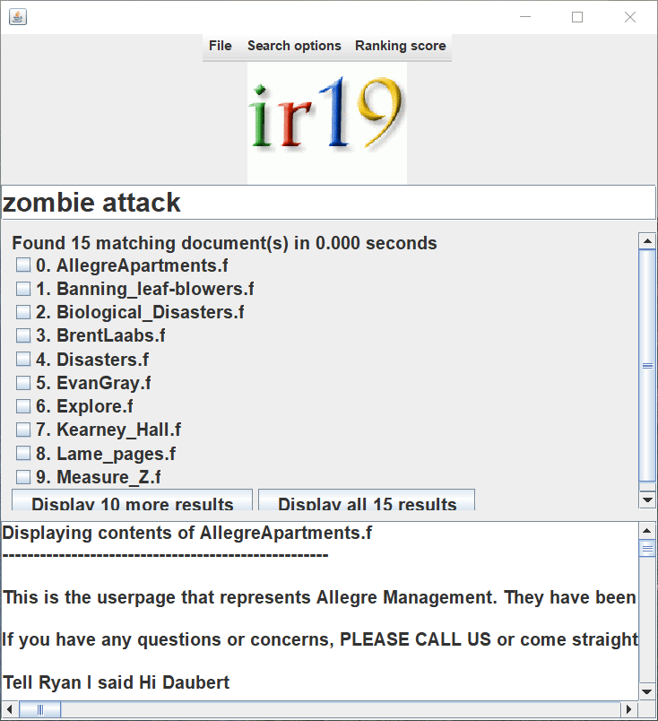
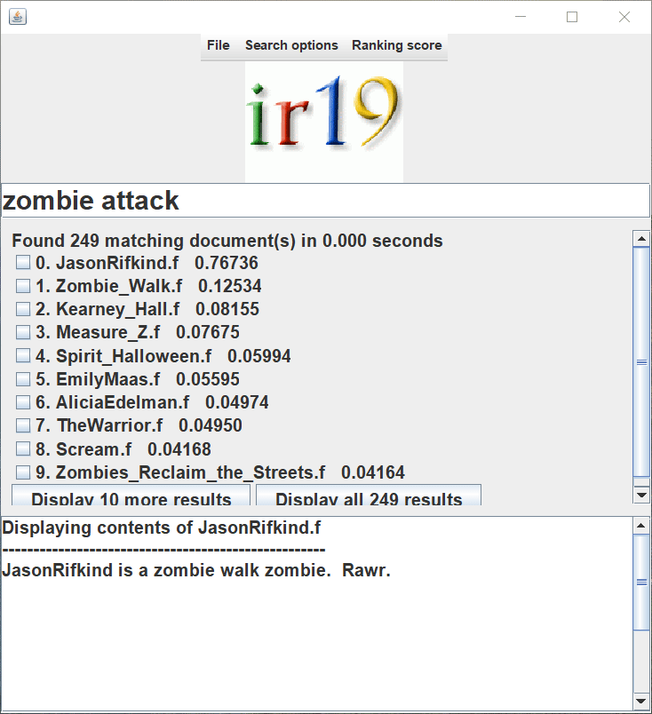
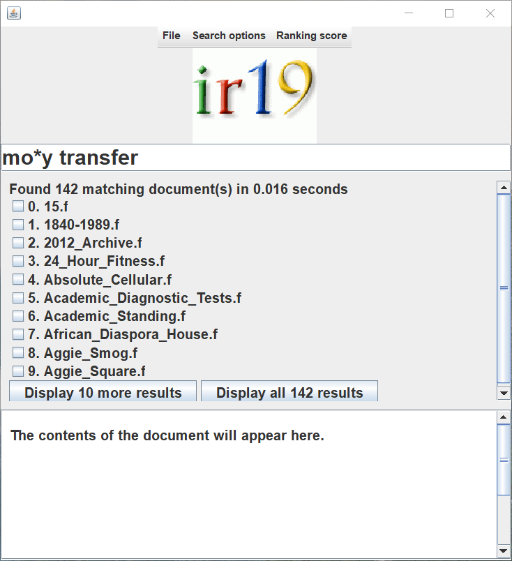
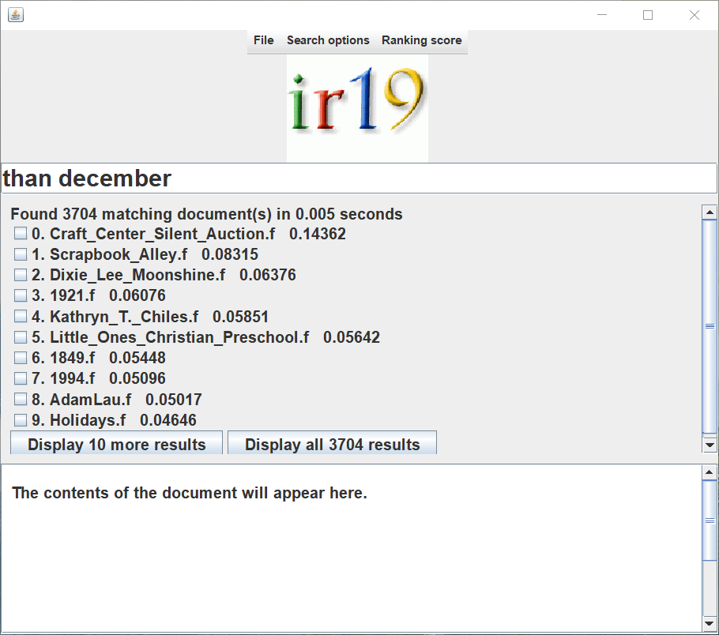

# Search Engine Project
Search Engine and Information Retriever course project.

## 1. Supporting functions
### 1.1 Search options
Supporting: 
- intersection search: return documents that contain at least one term in query
- phrase search: return documents that only contain the exact phrase
- ranked search:
  - td-idf
  - pagerank
  - tf-idf+pagerank combination
  - HITS: based on hubs and authorities scores



### 1.2 Other functions
#### 1.2.1 Relevance feedback
This function is called by clicking the box next to the resulting doc and press Enter to search again.

Note: This will create a new query based on the top 10 query terms and return the new results based on the new query.



#### 1.2.2 Wildcard query search
Use * as wildcard.



#### 1.2.3 Spelling correction



## 2. Run the search engine
Go to directory ./src and run:
#### Windows
```
compile_all.bat
run_search_engine.bat
```
#### Linux
```
sh compile_all.sh
sh run_search_engine.sh
```
